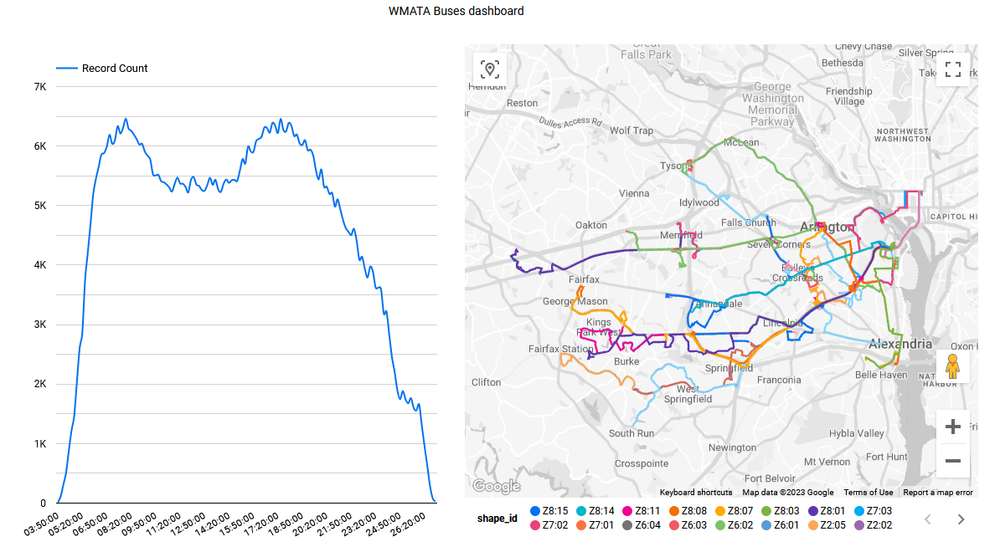

# WMATA Transport for Washington buses Data Engineering Project
 
## Overview
WMATA ( Washington Metropolitan Area Transit Authority ) schedules buses and trains in Washington Metropolitan Area and provides
data via [GTFS](https://gtfs.org/) api. 

This project aims to build an end-to-end orchestrated data pipeline. The pipeline will fetch bus data from wmata and save it locally, Then, the data will be uploaded to BigQuery with defined schemas and clustering (by sequential fields `stop_sequence` and `shape_pt_sequence`). In BigQuery, DBT will be used to transform the data. Finally, the data will be visualised in a dashboard.

## Tech stack
Docker, Terraform, BigQuery, dbt, Looker Studio, Prefect

## Questions
Visualize all the routes

Show number of buses distribution by time of day (in 10 minute buckets), GTFS time can include more than 24 hours

## Dashboard
<p align="center">

</p>

## Reproducing

1. Set up a GCP Environment account with the service account and project. 
2. Clone project ```git clone https://github.com/AQsAKo/de-final.git```
3. Install Docker
4. Set variables 
    ```bash
    export GOOGLE_APPLICATION_CREDENTIALS=<path_to_serviceaccount_json>
    export PREFECT_ACCOUNT_ID=<prefect-account-id>
    export PREFECT_WORKSPACE_ID=<prefect-workspace-id>
    export PREFECT_API_KEY=<prefect-key>
    export WMATA_KEY=8e2f2e3134924ca49be865340270bed6
    ```
    In project directory run `docker-compose build`
5. Start the built container with command `docker-compose run -rm prefect` 
    and initialize google cli with command `gcloud init` and login with your account and select project
6. Execute Terraform code
    - Change the directory to terraform folder containing the terraform configuration filester
      `cd terraform`
    
    - update the variable.tf file
    	   
    - Initialize 
      ```bash
      terraform init
      ```
    - Stage
      ```bash
      terraform plan
      ```
    - Deploy
      ```bash
      terraform apply
      ```
   
7. Setup your orchestration
	- Edit configurations
		- Edit `blocks.py` by changing project and bucket names
		- Edit `query_gtfs_api.py` with your project 
		- Edit `profiles.yml` file in dbt folder with location of your gcp resources (for example: europe-west1)
		- Edit `schema.yml` file with your project name on database (database: "your project name")
	- sign-up for the prefect cloud and create a workspace [here](https://app.prefect.cloud/auth/login)
	-  Generate a new API key (if you dont have any) and keep it safe 
		- click the icon at the bottom left corner
		- click on the profile (your name)
		- click on API Keys
		- click on Create API Key
		- enter API key name and click on Create
		- copy the API key and keep it safe
	- change the directory to prefect folder using `cd`
	- Log in to the Prefect Cloud dashboard		
		- `prefect cloud login -k [api_key]`
	- Create the prefect blocks
		- `python blocks.py` or  via the cloud UI [prefect blocks](https://docs.prefect.io/concepts/blocks/)
	- Deploy the pipeline (Please note this takes around one and a half hour to complete)
		- `python flows/deploy.py`
		- in Cloud UI, goto Deployment and a start a quick run
		- in terminal, run below command
			- `prefect agent start --pool default-agent-pool`
